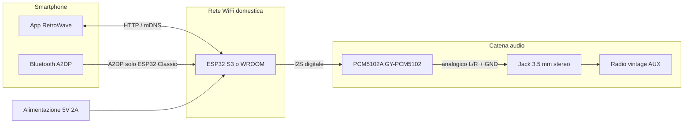
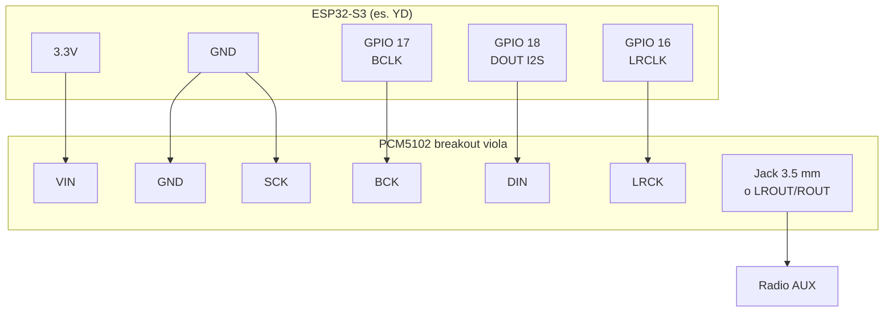

# RetroWave — Schema di collegamento hardware

Documento di riferimento per **ESP32-S3** e **ESP32-WROOM-32U** (DevKit + antenna U.FL) + modulo **GY-PCM5102 (PCM5102A)** + **radio con ingresso AUX**.

### Board **ESP32-WROOM-32U** (firmware PlatformIO `esp32-wroom-32u`)

- **Bluetooth**: BR/EDR + BLE — adatto al **sink A2DP** (telefono come sorgente audio).
- **Antenna**: collegare l’antenna **2,4 GHz** al connettore **U.FL** prima di alimentare (WiFi e BT usano la stessa radio).
- **I2S nel firmware** (default progetto verso PCM5102):

| Segnale I2S | GPIO (default `platformio.ini`) | Pin sul PCM5102 |
|-------------|-----------------------------------|-----------------|
| **BCLK**    | **GPIO 26**                       | **BCK**         |
| **LRCK/WS** | **GPIO 25**                       | **LCK**         |
| **DOUT**    | **GPIO 22**                       | **DIN**         |

Verifica sempre i valori effettivi in **`GET /diag`** → `i2s_expected` dopo ogni build. Se cambi GPIO, aggiorna `build_flags` (`-DI2S_BCLK=…` ecc.) in `firmware/platformio.ini`.

---

### Board **YD-ESP32-S3** (es. etichetta `YD-ESP32-23`, modulo `S3-N16R8`)

Sulle cloni tipo **YD-ESP32-S3** i pinheader **non riportano tutti i GPIO del chip**: in particolare **GPIO 25, 26 e 27 spesso non esistono sulla serigrafia** e non sono collegabili con un semplice jumper. Non è un errore: è una scelta di routing della PCB.

Per RetroWave usa un **mapping I2S su pin effettivamente presenti**. Nel firmware attuale è impostato:

| Segnale I2S | GPIO (scheda YD) | Pin sul modulo PCM5102 |
|-------------|-------------------|---------------------------|
| **BCLK** | **GPIO 17** | **BCK** |
| **DOUT** (ESP → DAC) | **GPIO 18** | **DIN** |
| **LRCK / WS** | **GPIO 16** | **LCK** |

Questi tre GPIO compaiono di solito **uno dopo l’altro** sul lato destro della tua scheda (etichette **16**, **17**, **18**), comodi da cablare.

> Se in futuro usi un’altra scheda ESP32-S3 **con** 25/26/27 esposti, puoi tornare a quel trio **oppure** lasciare 16/17/18: l’ESP32-S3 può instradare l’I2S su GPIO diversi (matrix), basta allineare **schema ↔ firmware**.

---

## Schema reale — cosa fai tu (e cosa no)

### Ponticelli **H1L, H2L, H3L, H4L** (pad al centro della PCB viola)

- **Di solito non devi fare nulla.** Se in fabbrica sono già ponticellati verso **L** (come nelle foto tipiche), la scheda è **già configurata** per I2S + ESP32.
- **Non** sono collegamenti da fare verso l’ESP32: sono **solo saldature di opzione** sul DAC. Non servono cavetti aggiuntivi tra “ponticello e ESP”.

### Cosa colleghi **con i fili** (obbligatorio)

Solo questa tabella: **un filo per riga**, più eventuale jack verso la radio.

| Da (ESP32-S3 **YD-ESP32-S3**) | A (breakout **PCM5102 viola**, fila principale bassa) | Note |
|-------------------------------|------------------------------------------------------|------|
| **3V3** | **VIN** | Alimentazione DAC a **3,3 V** (stesso piano logico dell’ESP32). |
| **GND** | **GND** | Massa comune (fondamentale). |
| **GPIO 17** | **BCK** | Bit clock I2S. |
| **GPIO 18** | **DIN** | Dati dall’ESP32 al DAC. |
| **GPIO 16** | **LRCK** | Word select / canale L/R. |
| **GND** | **SCK** | **Filo obbligatorio** su molte breakout: SCK a massa (nessun MCLK dall’ESP32). |

**Uscita audio:** dal jack **3,5 mm** sul modulo (o dai pad **LROUT / ROUT / AGND** sul lato, secondo la tua scheda) verso il cavo **AUX** della radio — **stereo + massa**.

### In sintesi

| Domanda | Risposta |
|---------|----------|
| Devo saldare/spostare i ponticelli H1–H4? | **No**, se sono già su **L** come da fabbrica. |
| Devo collegare qualcosa ai ponticelli con fili? | **No.** |
| Cosa devo cablare? | Solo **VIN, GND, BCK, DIN, LRCK, SCK→GND** come tabella sopra, più **jack/AUX**. |

---

## 1. Vista d’insieme (sistema)



---

## 2. Schema collegamenti ESP32-S3 ↔ GY-PCM5102

### 2.1 Diagramma logico (una unità)



**Nota:** sul PCM5102, **DIN** è l’ingresso dati seriali: va collegato al **DOUT I2S dell’ESP32** (su YD: **GPIO 18**), non al contrario.

---

### 2.2 Tabella cablaggio (dettaglio — stesso schema della sezione “Schema reale”)

| Pin sul modulo (PCM5102 viola) | Collegamento | Funzione |
|----------------------------------|--------------|----------|
| **VIN** | **3V3** ESP32 | Alimentazione (usa **3,3 V**, non 5 V se il modulo non lo richiede esplicitamente). |
| **GND** | **GND** ESP32 | Massa. |
| **BCK** | **GPIO 17** | Bit clock. |
| **DIN** | **GPIO 18** | Dati I2S ESP → DAC. |
| **LRCK** | **GPIO 16** | Word clock / L↔R. |
| **SCK** | **GND** | Filo a massa (vedi § 2.3). |
| **FLT, DEMP, XSMT, FMT** (pad **H1L–H4L**) | *Nessun filo verso ESP* | Configurazione **solo** con ponticelli in fabbrica; di solito **non tocchi nulla**. |
| Uscita | Jack **3,5 mm** o **LROUT/ROUT/AGND** | Verso cavo AUX radio. |

---

### 2.3 Ponticelli (H1L, H2L, H3L, H4L) e pin **SCK**: cosa sono e cosa fare

Sul PCM5102 ci sono **due cose diverse** che in giro vengono entrambe chiamate “ponticello”, ma **non sono la stessa cosa**:

#### A) I **quattro tripli pad** al centro della scheda (H1L … H4L)

Sono **opzioni di fabbrica / configurazione fissa**: si chiudono **una volta** (o restano come arrivano dalla fabbrica) saldando il centrale verso **L** (*Low*) o verso **H** (*High*), a seconda della tua scheda. Servono a portare a livello fisso alcuni ingressi del chip PCM5102:

| Pad | Funzione tipica | Posizione **L** (verso GND) | Perché per RetroWave / I2S con ESP32 |
|-----|------------------|-----------------------------|--------------------------------------|
| **H1L** | **FLT** — tipo di filtro digitale | Ponticello su **L** | Filtro “normale” / bassa latenza (come da datasheet; va bene per ascolto) |
| **H2L** | **DEMP** — de-enfasi | Ponticello su **L** | De-enfasi **disattivata** (corretto per musica/streaming, non CD con pre-enfasi) |
| **H3L** | **XSMT** — mute morbido / uscita | Ponticello su **L** | In combinazione con il resto del circuito della tua PCB, evita che l’uscita resti in mute “strano”; su alcune board **H** può essere richiesto per “unmute”: **se non senti nulla**, controlla il datasheet della tua breakout o prova solo dopo aver letto la stampa vicino al pad |
| **H4L** | **FMT** — formato seriale | Ponticello su **L** | **I2S classico** (non Left-Justified). Deve combaciare con il formato I2S che imposti nel firmware libreria audio |

**Regola pratica:** se la scheda **arriva già** con i quattro ponticelli su **L** (come nelle foto tipiche), **non è obbligatorio toccarli** per iniziare: è la configurazione più comune per I2S + ESP32. Intervieni solo se cambi formato audio o se il costruttore della breakout indica un’altra combinazione.

#### B) Il pin **SCK** sulla fila principale (accanto a BCK, DIN, …)

Questo **non** è il “ponticello H3”: è un **pin di collegamento**. Sul PCM5102, **SCK** è spesso il pin per **clock di sistema / MCLK** quando serve un clock esterno aggiuntivo.

Con **ESP32** che genera solo **BCK + LRCK + dati** (tipico per I2S “semplice”), **molti moduli** vogliono che **SCK sia collegato a GND**: in questo modo il DAC usa la modalità in cui il **clock di bit (BCK)** è sufficiente e non serve un MCLK separato dall’ESP32.

Quindi:

- **SCK → GND** = un **cavo** (o pista) dal pin **SCK** del modulo al **GND** comune (stesso GND dell’ESP32 e del modulo).
- **Non** confondere con **H3L**: quello regola un **ingresso interno** del chip (XSMT ecc.), mentre **SCK** è un **pin del connettore**.

#### Riepilogo in una frase

- **H1L–H4L** = configurazione “di fabbrica” sulla scheda DAC (di solito lasciate su **L**).  
- **SCK → GND** = collegamento elettrico necessario su **molte** breakout quando il microcontrollore **non** fornisce MCLK.

---

## 3. Schema ASCII (schema reale YD + PCM5102 viola)

```
     YD-ESP32-S3                         Breakout PCM5102 (fila bassa: VIN … SCK)
  +------------------+                  +------------------------------------------+
  | 3V3 -------------+------------------| VIN                                      |
  | GND -------------+------------------| GND                                      |
  | GPIO 17 (BCLK) ---+------------------| BCK                                      |
  | GPIO 18 (DOUT) ---+------------------| DIN                                      |
  | GPIO 16 (LRCK) ---+------------------| LRCK                                     |
  | GND -------------+------------------| SCK    (SCK deve andare a GND)          |
  +------------------+                  |  + centro scheda: H1L H2L H3L H4L        |
                                        |    (di solito NON li tocchi)             |
                                        |  + jack 3.5 mm  oppure LROUT/ROUT/AGND   |
                                        +---------------------|--------------------|
                                                              v
                                                       [ AUX radio ]
```

---

## 4. Uscita verso la radio (AUX)

- L’uscita del PCM5102 è **analogica stereo**: tipicamente **L**, **R** e **GND** sul connettore del modulo o su punti saldatura verso il jack.
- Un **cavo jack 3.5 mm stereo** (maschio-maschio o adattatore) collega il DAC all’**ingresso AUX** della radio.
- **Massa in comune** tra ESP, DAC e scocca/shield del cavo riduce rumori e ronzii.

---

## 5. Alimentazione

| Elemento | Indicazione |
|----------|----------------|
| ESP32-S3 | Spesso **5 V** via USB; il regolatore onboard fornisce **3.3 V** per logica e (se adeguato) per il GY-PCM5102 |
| PCM5102 viola | **3.3 V** su **VIN** (come da tabella) |
| Consumo | Preferire alimentatore **5 V / ≥ 2 A** stabile per unità; picchi WiFi + audio possono far “cadere” la tensione se l’alimentatore è debole |

**Non collegare 5 V direttamente su VCC del modulo GY-PCM5102** se il modulo è a 3.3 V (come da documentazione progetto).

---

## 6. Bluetooth e telefono (contesto, non è un cavo)

- Lo smartphone invia audio in **Bluetooth A2DP** all’ESP32 (modalità ricevitore nel firmware).
- Non servono fili extra tra telefono e DAC oltre alla **catena digitale I2S** già descritta; l’ESP32 invia l’audio al **PCM5102** come per il flusso radio.

---

## 7. Cosa verificare prima di accendere

1. **GND comune** tra ESP32 e DAC.
2. **Nessuno scambio** tra **BCK / LRCK / DIN**.
3. **SCK del modulo collegato a GND** (filo dedicato).
4. Ponticelli **H1L–H4L**: se già su **L**, **non modificarli**; se non senti nulla, controlla il manuale della breakout (a volte **XSMT** / H3L va verificato).
5. Cavo **AUX** nell’ingresso corretto della radio (**AUX / LINE IN**), volume adeguato.

---

*Schema allineato a **YD-ESP32-S3** + breakout **PCM5102 viola** (VIN, LRCK, fila H1L–H4L). Firmware: GPIO **16 / 17 / 18** in `firmware/src/main.cpp`.*
